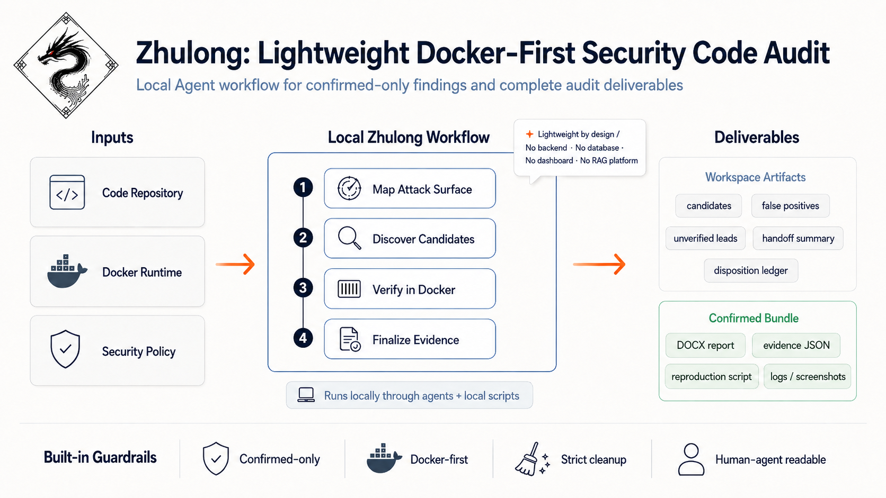

<div align="center">


<h1>Zhulong (烛龙)</h1>

<p><strong>A modular security-focused code audit workflow for local agents,<br>
with Docker reproduction before confirmation.</strong></p>

<p><em>That which illumines the nether gloom — Zhulong, the Torch Dragon.</em><br>
<em>是烛九阴，是谓烛龙。</em></p>

<p>
  <a href="#"></a>
  <a href="#"></a>
  <a href="LICENSE"></a>
  <a href="#quick-start"></a>
  <a href="#audit-workflow"></a>
</p>

<p>
  <a href="README.md">English</a> •
  <a href="README.zh-CN.md">简体中文</a> •
  <a href="docs/USAGE.md">Usage</a> •
  <a href="CHANGELOG.md">Changelog</a>
</p>

</div>

---

## ⚡ Features At A Glance

- 🛡️ **Docker-first verification:** Findings are reported as confirmed only
  after Docker or Docker Compose evidence supports them.
- 🎯 **Confirmed-only deliverables:** Scanner alerts, dependency hints, static
  findings, and LLM guesses stay quarantined until evidence is strong enough.
- 🌱 **Seeded variant discovery:** Confirmed vulnerabilities can be converted
  into auditable seed cards and same-repository variant candidates, but every
  variant still needs its own Docker reproduction before confirmation.
- 🔌 **Lightweight and modular:** No required backend, dashboard, database,
  vector store, or RAG platform; Zhulong runs through local agent modules and
  scripts.
- 🤝 **Human-agent readable:** Workspaces, handoff summaries, and machine-readable
  decision logs are designed for both AI coding agents and human reviewers.

---

## Contents

| Section | What It Covers |
| :--- | :--- |
| [Project Overview](#-project-overview) | Defines Zhulong's positioning, compact workflow, and reproduce-before-confirmation principle. |
| [Why Choose Zhulong?](#-why-choose-zhulong) | Maps common audit pain points to Zhulong's lightweight, evidence-driven approach. |
| [System Architecture](#-system-architecture) | Shows the local modular pipeline and how agents, scripts, Docker, and artifacts fit together. |
| [Quick Start](#-quick-start) | Covers platform support, skill sync, agent prompts, and manual script startup. |
| [What Zhulong Produces](#-what-zhulong-produces) | Describes the audit workspace and confirmed vulnerability evidence bundle. |
| [Audit Workflow](#-audit-workflow) | Breaks down the main stages from project intake to final handoff. |
| [Dependencies And Optional Integrations](#%EF%B8%8F-dependencies-and-optional-integrations) | Lists required runtime dependencies and optional security tool families. |
| [Project Layout](#-project-layout) | Summarizes the plugin source tree, scripts, assets, and documentation. |
| [Source Development Guide](#-source-development-guide) | Explains agent-assisted maintenance and the safety contracts contributors must preserve. |
| [Important Security Notice](#%EF%B8%8F-important-security-notice) | States authorized-use boundaries, prohibited uses, and responsibility expectations. |
| [Contributing And Community](#-contributing-and-community) | Provides contribution entry points, contact channels, roadmap, and acknowledgements. |
| [Project Documentation](#-project-documentation) | Indexes installation, usage, maintenance, release, and security documents. |
| [License](#-license) | Links to the project license. |

---

## 🔭 Project Overview

Zhulong is a modular, agent-operable security code audit workflow for
authorized review. It is not a scanner-only tool and not a heavyweight audit
platform. Instead, it gives a local AI coding agent a disciplined path from
repository understanding to Docker-backed verification and reviewer-ready
deliverables.

The workflow is intentionally compact:

> `Import Project` → `Map Attack Surface` → `Generate Candidates` →
> `Reproduce in Docker` → `Package Evidence` → `Handoff Results`

Zhulong is built for four recurring audit pains:

- **High false-positive burden:** unverified scanner or LLM claims consume reviewer time.
- **Reproduction gap:** source-level suspicion does not prove runtime impact.
- **Artifact fragmentation:** evidence, scripts, reports, and triage notes often drift apart.
- **Handoff fragility:** long chat context is hard for another agent or human to resume.

> **💡 Core principle:** Zhulong reports a vulnerability as confirmed only after it
> has been reproduced in Docker or Docker Compose and its report package has
> passed automated consistency checks. Everything else stays as a candidate,
> false positive, unverified lead, or blocked item.

---

## ⚖️ Why Choose Zhulong?

Zhulong is designed for teams that want security audit automation without a
heavy platform rollout or a stream of unverified findings to manually clean up.

| Traditional Audit Pain | Zhulong Approach |
| :--- | :--- |
| **Noisy scanner or LLM output** | Zhulong keeps each possible issue in a machine-readable decision log, `audit-disposition.json`, so unverified leads cannot silently become confirmed reports. |
| **Manual evidence reconstruction** | Each confirmed vulnerability is packaged with its report, reproduction notes, attachment index, evidence JSON, logs, screenshots, and one root run script. |
| **Source-level claims lack trust** | If an issue can be checked at runtime, Zhulong asks the agent to reproduce it in Docker or Docker Compose before reporting it as confirmed. |
| **Heavy platforms are expensive** | Zhulong runs as local agent modules plus scripts. No required backend, dashboard, database, vector store, or RAG platform. |
| **Narrative-only final status** | Automated checks verify the report files, evidence files, decision log, and Docker cleanup state before a run is marked complete. |
| **Docker residue and environment drift** | Zhulong records the starting Docker state, checks for newly created containers/images/networks/volumes, and refuses broad cleanup that could delete unrelated user resources. |
| **Agent work becomes a black box** | Workspace files, handoff summaries, and deterministic outputs are readable by both AI coding agents and human reviewers. |

---

## 🧩 System Architecture

### Overall Architecture

Zhulong uses a local modular workflow. The core path is driven by an agent
runtime plus local scripts, automated checks, reference docs, Docker safety
checks, and workspace outputs.

<div align="center">
  
  <p><em>Zhulong pipeline: turning source code into validated evidence packages.</em></p>
</div>

The diagram above is the intended mental model: small local modules turn a
repository, Docker runtime, and project policy into either quarantined
candidates or validated evidence packages. The durable rules live in scripts,
automated checks, reference docs, and workspace outputs, so the workflow remains
portable across local agent environments instead of becoming a hidden chat-only
procedure.

---

## 🚀 Quick Start

Zhulong runs through a local agent, Docker, repository-local scripts, and
optional security tools. For the full dependency table, see the
Dependencies And Optional Integrations section below. For all launch prompts,
manual startup options, and `asr_start.sh` parameters, see
[`docs/USAGE.md`](docs/USAGE.md).

### Platform Support

The commands below assume a Unix-like shell because Zhulong's runtime helpers
are Bash/Python scripts and reproduction runs happen in Docker or Docker
Compose.

| Platform | Recommended path | Notes |
| :--- | :--- | :--- |
| **macOS** | ✅ Supported and release-tested | Use Docker Desktop or another Docker Engine, Python 3.11+, Bash, and the local agent skill sync path. |
| **Linux** | ✅ Supported target path | Use Docker Engine, Docker Compose, Python 3.11+, Bash, and the same commands shown below. Override `CLAUDE_SKILLS_DIR` if your agent uses a non-default skill directory. |
| **Windows** | ⚠️ Use WSL2 | Run Zhulong inside WSL2, keep the audit workspace on the WSL filesystem when possible, and enable Docker Desktop WSL integration. Native PowerShell/CMD execution is not a first-class supported path yet. |

### Method 1: Local Agent Skill Sync (Recommended)

From the plugin package root, run the selftest and sync the stable skill
layout into your local agent environment:

```bash
# 1. Test and sync
python3 scripts/selftest_plugin.py
bash scripts/sync_to_claude_skill.sh

# 2. Verify installed layout
python3 ~/.claude/skills/zhulong/scripts/selftest_plugin.py
```

Restart the local agent session after syncing. The current stable
Claude-compatible runtime path is:

```text
~/.claude/skills/zhulong/
```

Then use a short prompt in your supported local agent:

> **🤖 Prompt your agent**
>
> Please use the zhulong skill to perform an end-to-end security-focused code
> audit on this repository:
> `https://github.com/owner/repo`
>
> Output language: en-US.

> This is the recommended path for release-candidate validation and real
> project testing.

### Output Language

Use `Output language: en-US` for English reports and `Output language: zh-CN`
for Simplified Chinese reports. The selected language applies to the generated
workspace summaries, confirmed vulnerability reports, reproduction notes, and
reviewer-facing handoff files.

### Method 2: Manual Script Start

If you want to start from the terminal without relying on agent skill discovery:

```bash
# Remote repository
bash scripts/asr_start.sh --source https://github.com/owner/repo

# Existing local repository
bash scripts/asr_start.sh --repo-root /path/to/repo
```

---

### Expected Result

Zhulong creates a timestamped `security-research-YYYYMMDD-HHMMSS/` workspace
inside the target repository. If a vulnerability is confirmed, Zhulong writes a
validated evidence package under `confirmed/`. If no vulnerability is confirmed,
the run can still finish cleanly with candidates, false positives, unverified
leads, handoff notes, and completion evidence preserved.

## 🌟 What Zhulong Produces

Each audit run creates a timestamped workspace inside the target repository:

```text
<repo>/security-research-YYYYMMDD-HHMMSS/
├── 📊 audit-disposition.json     # machine-readable issue decision log
├── 🗺️ attack-surface.md          # repository-specific attack surface notes
├── 🔍 candidate-findings.md      # plausible issues still under review
├── ❌ false-positives.md         # reviewed and rejected issues
├── ❓ unverified-leads.md        # plausible but not Docker-confirmed leads
├── 📝 handoff-summary.md         # resume notes for humans and agents
├── 🏁 SUMMARY.md                 # final workspace summary
├── 🧭 runtime/                   # runtime hygiene status
├── 🐳 docker/                    # Docker baseline and cleanup status
├── 🔎 evidence/                  # supporting evidence
│   └── variant-analysis/         # optional seed cards and variant candidates
└── 🎯 confirmed/                 # confirmed vulnerability packages, if any
```

Confirmed vulnerabilities are delivered as one folder per vulnerability:

```text
confirmed/<vulnerability-slug>/
├── 📄 <finding-specific-report>.docx
├── 🔗 <finding-specific-attachment-index>.md
├── 🛠️ <finding-specific-reproduction-supplement>.md
├── 🧾 verification-evidence.json
├── 🚀 run-<slug>-recording.sh
└── 📂 attachments/
```

A finding is not considered confirmed until runtime evidence exists from Docker
or Docker Compose and Zhulong's automated report-package checks pass.

When a confirmed bundle already exists, Zhulong can run a bounded seeded variant
pass: `extract_variant_seed.py` turns the confirmed finding into a Variant Seed
Card, and `find_variant_candidates.py` ranks same-repository candidates under
`evidence/variant-analysis/`. These artifacts are auxiliary triage material:
they must not appear in confirmed bundles as primary evidence, and no variant is
confirmed until it has its own Docker reproduction and validated confirmed
bundle.

For collaboration details, report quality checks, validation commands, example
finding shape, and limitations, see [`docs/WORKFLOW_DETAILS.md`](docs/WORKFLOW_DETAILS.md).

---

## 🔄 Audit Workflow

| Step | Stage | Responsible Module | Main Action |
| :---: | :--- | :--- | :--- |
| 1 | Project intake | Local agent + start script | Receive the target, create a timestamped workspace, record the starting Docker state, and load reference rules. |
| 2 | Recon and modeling | Agent + playbook references | Fingerprint the repository, map entry points, trust boundaries, sinks, deployment assumptions, and security policy. |
| 3 | Candidate discovery | Agent + local tools | Use scanners, playbooks, dependency hints, static reasoning, LLM reasoning, and optional confirmed-seed variant expansion as candidate generators only. |
| 4 | Docker verification | Safety pre-check + verification scripts | Reject unsafe verification containers, reproduce candidates in Docker or Compose, and collect concrete evidence. |
| 5 | Decision and packaging | Decision log + package checks | Classify each issue as confirmed, false positive, unverified, blocked, or still a candidate; generate a validated evidence package for confirmed vulnerabilities. |
| 6 | Completion and handoff | Completion checks + assertion scripts | Recheck Docker cleanup state, validate the decision log and evidence packages, then write final summary and handoff files. |

---

## 🖥️ Dependencies And Optional Integrations

Zhulong is intentionally lightweight: the core workflow is a local agent entry
point plus repository-local scripts and automated checks. Docker is required
when a vulnerability needs runtime reproduction; most security tools are
optional ways to surface leads.

| Dependency / Integration | Required? | Role in Zhulong | Link |
| :--- | :---: | :--- | :--- |
| **Local coding agent runtime** | Required for the intended workflow | Reads the Zhulong skill/docs, coordinates repository review, and runs local scripts. The current stable path is Claude-compatible skill sync; script-based manual startup remains available. | [Claude Code docs](https://docs.anthropic.com/en/docs/claude-code/overview) |
| **Python 3.11+** | Required | Runs automated checks, completion checks, selftests, report rendering helpers, and workspace integrity checks. | [python.org](https://www.python.org/) |
| **Docker Engine / Docker Desktop** | Required for confirmed vulnerabilities | Provides the isolated runtime for reproduction. If Docker is unavailable, Zhulong pauses or records the verification as blocked instead of falling back to host execution. | [Docker docs](https://docs.docker.com/engine/) |
| **Docker Compose** | Required when target verification uses Compose | Starts target applications and verification stacks using project-native or generated Compose files. | [Docker Compose docs](https://docs.docker.com/compose/) |
| **Git** | Required for remote targets | Clones target repositories and preserves source-control context. | [git-scm.com](https://git-scm.com/) |
| **POSIX shell / Bash** | Required | Runs workspace helpers, Docker hygiene checks, initial probes, and reproduction scripts. | [GNU Bash](https://www.gnu.org/software/bash/) |
| **GitHub CLI (`gh`)** | Optional | Helps with GitHub clone/auth flows and repository metadata lookup when available. | [GitHub CLI](https://cli.github.com/) |
| **oh-my-claudecode (OMC)** | Optional multi-agent enhancement | Only needed if you choose OMC `/team`, `/ultrawork`, or related multi-agent modes. Zhulong treats OMC multi-agent worker PIDs as review-only and does not require OMC for normal audits. | [OMC GitHub](https://github.com/Yeachan-Heo/oh-my-claudecode) |

Optional security tools are discovered at runtime and recorded in the workspace.
Missing tools are treated as skipped probes, not audit blockers.

<details>
<summary><b>Click to expand: optional security tool families</b></summary>
<br>

| Optional tool family | Examples | Role | Confirmation rule |
| :--- | :--- | :--- | :--- |
| **SAST / pattern scanning** | [Semgrep](https://github.com/semgrep/semgrep), [CodeQL](https://codeql.github.com/) | Broad code-pattern discovery and custom rule exploration. | Results remain candidates until Docker reproduction evidence and report-package checks pass. |
| **Dependency and OSV scanning** | [OSV-Scanner](https://github.com/google/osv-scanner), [`npm audit`](https://docs.npmjs.com/cli/commands/npm-audit), [pip-audit](https://github.com/pypa/pip-audit), [govulncheck](https://go.dev/doc/security/vuln/) | Dependency advisory discovery and language ecosystem vulnerability hints. | Dependency-only results cannot be reported as confirmed vulnerabilities. |
| **SBOM and image analysis** | [Syft](https://github.com/anchore/syft), [Grype](https://github.com/anchore/grype), [Trivy](https://github.com/aquasecurity/trivy) | SBOM generation, filesystem/image scanning, and container vulnerability hints. | Scanner output is lead evidence only until reviewed and reproduced. |
| **Secret scanning** | [Gitleaks](https://github.com/gitleaks/gitleaks), [TruffleHog](https://github.com/trufflesecurity/trufflehog) | Secret exposure discovery with sanitized summaries and raw logs preserved locally. | Secret findings require human triage and scoped evidence before disclosure. |
| **Focused DAST helpers** | [Nuclei](https://github.com/projectdiscovery/nuclei), [ffuf](https://github.com/ffuf/ffuf), [sqlmap](https://github.com/sqlmapproject/sqlmap), [OWASP ZAP](https://www.zaproxy.org/) | Focused checks against authorized local Docker targets. | No aggressive or external testing without explicit authorization. |
| **Language-specific analyzers** | [gosec](https://github.com/securego/gosec), [SpotBugs](https://spotbugs.github.io/), [FindSecBugs](https://find-sec-bugs.github.io/), Maven, Gradle | Ecosystem-specific static or dependency context for Java, Go, and other stacks. | Results feed triage, not confirmed status by themselves. |
| **Document QA helpers** | [LibreOffice](https://www.libreoffice.org/), [MarkItDown](https://github.com/microsoft/markitdown) | Optional DOCX conversion or readability smoke tests. | Does not affect vulnerability confirmation. |

</details>

The canonical dependency inventory lives in
[`assets/tool-registry.json`](assets/tool-registry.json).

---

## 📁 Project Layout

```text
zhulong/
├── .claude-plugin/plugin.json          # Claude plugin-style discovery metadata
├── .codex-plugin/plugin.json           # Cross-agent / Codex metadata
├── skills/zhulong/SKILL.md             # Agent skill entry point
├── templates/claude-skill/SKILL.md     # Installed skill template
├── scripts/                            # Runtime helpers and automated checks
│   ├── asr_start.sh                    # Create or reuse an audit workspace
│   ├── manage_docker_resources.py      # Docker baseline, exact cleanup, strict hygiene
│   ├── check_sandbox_preflight.py      # Unsafe verification container rejection
│   ├── audit_disposition.py            # Workspace-level issue decision log
│   ├── finalize_audit_workspace.py     # Completion checks before handoff
│   ├── assert_finalized_workspace.py   # Finalized workspace integrity checks
│   ├── extract_variant_seed.py         # Confirmed bundle -> Variant Seed Card
│   ├── find_variant_candidates.py      # Seed card -> same-repo ranked candidates
│   ├── validate_report_bundle.py       # Confirmed vulnerability package checker
│   └── selftest_plugin.py              # Release and packaging selftest
├── assets/
│   ├── branding/                       # README visuals and logo assets
│   ├── attacker-container/             # Optional local attacker container template
│   ├── references/                     # Playbooks, safety contracts, output templates
│   ├── schemas/                        # Structured schemas such as Variant Seed Card
│   └── examples/                       # Example structured inputs
├── docs/                               # Usage, workflow, install, maintenance, and release docs
│   ├── INSTALL.md
│   ├── USAGE.md
│   ├── USAGE.zh-CN.md
│   ├── WORKFLOW_DETAILS.md
│   ├── WORKFLOW_DETAILS.zh-CN.md
│   ├── AGENTS.md
│   └── RELEASE_CHECKLIST.md
├── SECURITY.md                         # Responsible disclosure and security policy
├── DISCLAIMER.md                       # Authorized-use and no-warranty notice
├── CONTRIBUTING.md
├── CHANGELOG.md
├── README.md
└── README.zh-CN.md
```

Generated audit workspaces are written inside the target repository, not inside
the plugin source tree.

---

## 🔧 Source Development Guide

This section is for contributors who want to modify Zhulong itself. The intended
maintenance path is agent-assisted: developers keep the product intent in mind,
then ask Codex, Claude Code, Cursor, Gemini CLI, or another local coding agent
to read the project rules before making a narrow patch.

For complete rules, read:

- [`docs/AGENTS.md`](docs/AGENTS.md) for AI coding agents maintaining Zhulong
- [`CONTRIBUTING.md`](CONTRIBUTING.md) for contributor principles
- [`docs/RELEASE_CHECKLIST.md`](docs/RELEASE_CHECKLIST.md) for pre-release checks

### Environment Requirements

- Python 3.11+
- Docker and Docker Compose
- A local agent runtime that can load the `skills/zhulong` entry point
- Optional security tools listed in `assets/tool-registry.json`

### Development Loop

Give your coding agent this project rule file first:

```text
Read `docs/AGENTS.md`, `CONTRIBUTING.md`, and
`docs/RELEASE_CHECKLIST.md` before editing.
Keep the change narrow.
Do not weaken the rules that keep unverified issues out of confirmed reports,
require Docker reproduction when applicable, protect Docker cleanup, keep OMC
multi-agent worker process handling review-only, reject unsafe verification containers,
or validate confirmed vulnerability packages before release.
```

```bash
# 1. Run the source-tree selftest
python3 scripts/selftest_plugin.py

# 2. If skill-facing files changed, sync and test the installed layout
bash scripts/sync_to_claude_skill.sh
python3 ~/.claude/skills/zhulong/scripts/selftest_plugin.py

# 3. If report output changed, validate affected confirmed vulnerability packages
python3 scripts/validate_report_bundle.py --bundle-dir <bundle-dir>
python3 scripts/validate_all_report_bundles.py --confirmed-dir <confirmed-dir>
```

### Maintenance Rules Summary

- Keep proof-of-concept execution in Docker or Docker Compose; do not add host-machine execution as a verification alternative.
- Keep scanner, dependency, static, and LLM output as candidates until Docker
  evidence and report-package checks pass.
- Update report generation and automated checks together when report output changes.
- Keep Docker residue separate from OMC/runtime residue.
- Do not add broad Docker prune, broad process cleanup, PID signaling, wildcard
  adoption, or machine-specific paths.
- Keep optional tools optional; do not turn third-party services, MCP servers,
  RAG platforms, dashboards, or databases into required runtime dependencies.
- If workflow behavior changes, update scripts, reference docs, selftests, and
  release checks together.

---

## ⚠️ Important Security Notice

Zhulong is for authorized security-focused code review only, and is intended
only for academic research, teaching, and learning in cyberspace security. The
most important rules are:

- Use Zhulong only on repositories, systems, containers, accounts, networks,
  and infrastructure you own or are explicitly authorized to test.
- Do not use Zhulong for unauthorized scanning, exploitation, credential theft,
  data exfiltration, persistence, denial of service, or bypassing access
  controls.
- Follow the policies of your selected agent runtime, model provider, IDE, code
  host, bug bounty program, employer, customer, and jurisdiction.
- Treat generated findings as evidence packages that still require qualified
  human review and responsible disclosure.
- Users are responsible for the legal, compliance, operational, and data
  handling consequences of their own use.

For complete authorized-use terms, disclaimers, and vulnerability reporting
guidance, see [`DISCLAIMER.md`](DISCLAIMER.md) and [`SECURITY.md`](SECURITY.md).

---

## 🫶 Contributing And Community

Contributions are welcome, especially small, well-scoped changes that preserve
Zhulong's lightweight local-agent design, discipline around reporting only
verified vulnerabilities,
and Docker-based reproduction model. Issues, pull requests, documentation
improvements, test fixtures, stronger automated checks, and real project
release-candidate test reports are all useful.

Please read [`CONTRIBUTING.md`](CONTRIBUTING.md) before opening a pull request.
If you use an AI coding agent to maintain Zhulong, ask it to read
[`docs/AGENTS.md`](docs/AGENTS.md) first.

### Contact

For technical questions, feature suggestions, collaboration, or
security-sensitive discussion, contact:

| Channel | Contact |
| --- | --- |
| Email | [torchbearer127@qq.com](mailto:torchbearer127@qq.com) |
| GitHub | [@Torchbearer127](https://github.com/Torchbearer127) |
| Rednote | `1103633904` |

### Naming Philosophy: Holding Torch To Illuminate The Nether Gloom

> Named after Zhulong (the Torch Dragon) from ancient Chinese mythology, a deity who holds a torch to illuminate the sunless netherworld.
>
> Unverified alerts and static code scans are merely shadows. This plugin does not guess at shadows; it brings the torch. By reproducing potential exploits inside an isolated Docker sandbox, it illuminates the hidden execution paths of a codebase.
>
> In myth, Zhulong opens its eyes to create daylight and closes them to bring the night. In practice, this workflow opens its eyes to expose undeniable, runtime-verified proof, and closes them to seal a flawless chain of evidence.
>
> From absolute darkness to absolute clarity: ONE OPENING, ONE CLOSING, ONE DEFINITIVE AUDIT.

### Development Plan

Zhulong is already useful as a lightweight local-agent audit workflow, but it
will continue to evolve carefully. The priority is reliability and clear
evidence.

Completed:

- [x] Local agent skill packaging with script-based manual startup.
- [x] Docker or Docker Compose reproduction before confirmed vulnerability reporting.
- [x] Evidence packages for confirmed vulnerabilities, including report, reproduction notes, evidence JSON, logs/screenshots, and run script.
- [x] Machine-readable issue decision log and handoff summaries for human-agent collaboration.
- [x] Safety checks for unsafe verification containers, Docker residue, and review-only OMC multi-agent worker process handling.

Planned:

- [ ] Improve installation and examples for Linux and WSL2 users.
- [ ] Add clearer sample workspaces and sanitized example outputs.
- [ ] Expand compatibility notes for additional local agent environments, including Codex and Cursor.
- [ ] Continue tightening report consistency checks based on real project testing.

### Acknowledgements

Zhulong stands on the shoulders of the local-agent and open-source security
tooling communities. Special thanks to:

- Docker and Docker Compose for making local, reproducible verification
  practical.
- Claude Code and the broader local coding-agent ecosystem for the agentic
  workflow surface that Zhulong packages into a maintainable skill.
- The OMC community for multi-agent workflow ideas and for motivating explicit
  boundaries around stale multi-agent worker processes and runtime state.
- Semgrep, OSV-Scanner, Syft, Grype, Trivy, Gitleaks, TruffleHog, Nuclei, ffuf,
  sqlmap, OWASP ZAP, language-specific security tools, DeepAudit, and other
  security audit tools for useful capability inspiration.
- Everyone who tests Zhulong on real projects, reports confusing outputs, and
  helps keep the workflow evidence-backed instead of hype-driven.

---

## 📖 Project Documentation

| Document | Audience | What It Covers |
| --- | --- | --- |
| [`docs/INSTALL.md`](docs/INSTALL.md) | New users | Installation paths, local skill sync, and setup notes. |
| [`docs/USAGE.md`](docs/USAGE.md) | Operators | Launch prompts, trial-run prompts, manual startup commands, and `asr_start.sh` options. |
| [`docs/AGENTS.md`](docs/AGENTS.md) | AI coding agents and maintainers | Development rules, non-negotiable workflow contracts, and safe patch boundaries. |
| [`CONTRIBUTING.md`](CONTRIBUTING.md) | Contributors | Contribution expectations, test discipline, and scope control. |
| [`docs/RELEASE_CHECKLIST.md`](docs/RELEASE_CHECKLIST.md) | Maintainers | Pre-release checks for packaging, safety, docs, and regressions. |
| [`SECURITY.md`](SECURITY.md) | Users and reporters | Responsible use, reporting security issues in Zhulong, and disclosure guidance. |
| [`DISCLAIMER.md`](DISCLAIMER.md) | All users | Authorized-use boundary, prohibited use, agent/provider policy compliance, and liability limits. |
| [`CHANGELOG.md`](CHANGELOG.md) | Release readers | Version history and notable behavior changes. |
| [`docs/WORKFLOW_DETAILS.md`](docs/WORKFLOW_DETAILS.md) | Operators and reviewers | Human-agent collaboration, report quality checks, validation commands, example finding shape, and limitations. |
| [`assets/references/docker-resource-hygiene.md`](assets/references/docker-resource-hygiene.md) | Operators and maintainers | Docker baseline, exact cleanup, residue handling, and no-broad-prune rules. |
| [`assets/references/omc-runtime-stability.md`](assets/references/omc-runtime-stability.md) | Multi-agent users | OMC runtime status, stale sockets, and review-only multi-agent worker process handling. |
| [`assets/references/confirmed-vuln-docx-format.md`](assets/references/confirmed-vuln-docx-format.md) | Report authors and maintainers | Confirmed vulnerability report format, DOCX expectations, and attachment guidance. |

---

## 📄 License

MIT — see [`LICENSE`](LICENSE).
